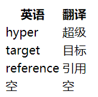

# 《HTML 常用标签》

## a 标签

### 作用

1. 跳转外部页面
2. 跳转内部锚点
3. 跳转邮箱或电话等

### 属性

- href
  1. 网址
     - https://google.com
     - http://google.com
     - //google.com 无协议网址，会自动选择 http 或 https
  2. 路径
     - /a/b/c （绝对路径）以及 a/b/c（相对路径）
     - index.html 以及 ./index.html
  3. 伪协议
     - javascript:代码;
       应用：一般里面不写代码，做一个点击之后什么都不发生的链接
     - mailto:写邮箱 发邮件给写的邮箱
     - tel:写电话号码 点击自动波打电话
  4. id
     - #xxx 写个 id 会跳转到对应 id 标签的位置
     - 只写 # 刷新页面

```html
<a href="http://baidu.com" target="_blank">百度网址</a>
<a href="Desktop/task-12/a-href.html" target="_blank">路径</a>
<a href="javascript:alert(1);">javascript伪协议</a>
<a href="#xxx">跳转内锚点</a>
```

- target

  1.  self 在本页打开（默认）
  2.  blank 在新页面打开
  3.  top 在顶层打开
  4.  parent 在父级窗口打开
  5.  xxx 创建一个新窗口叫 xxx
      另外：其他设置为 target="xxx"的 ，都会在 name= "xxx" 的窗口打开

- download 下载 URL（很少用）
- rel=noopener （以后讲）

## img 标签

### 作用

发出一个 get 请求，展示一张图片

### 属性

1. src 写图片路径
2. alt 图片加载失败显示的内容
3. width 图片宽度
4. height 图片高度
   注意：宽/高设置一向另一项会按比例自动调整，设置一项即可，都设置图片会变形
   _程序员的底线：永远不要让图片变形_

### 事件

1. onload
2. onerror

- JS，测试用,监听图片是否加载成功，可以加备用图片

```html
<body>
  
  <script>
    xxx.onload = function () {
      console.log("图片加载成功");
    };
    xxx.onerror = function () {
      console.log("图片加载失败");
      xxx.src = "./img/备用图";
    };
  </script>
</body>
```

### 响应式

图片适应屏幕，css 加上最大宽度 100%
max-width:100%

## table 标签

### 写法

table 标签里只能有 thead/tbody/tfoot 这三个标签
头尾可以没有，但 tbody 必须有

```html
<!-- 单表头表格 -->
<table>
  <thead>
    <tr>
      <!-- table row -->
      <th>英语</th>
      <!-- table header cell -->
      <th>翻译</th>
    </tr>
  </thead>
  <tbody>
    <tr>
      <td>hyper</td>
      <!-- table data cell -->
      <td>超级</td>
    </tr>
    <tr>
      <td>target</td>
      <td>目标</td>
    </tr>
    <tr>
      <td>reference</td>
      <td>引用</td>
    </tr>
  </tbody>
  <tfoot>
    <tr>
      <td>空</td>
      <td>空</td>
    </tr>
  </tfoot>
</table>
```

效果：


```html
<!-- 横竖两表头表格 -->
<table>
  <thead>
    <tr>
      <th></th>
      <th>小红</th>
      <th>小明</th>
      <th>小亮</th>
    </tr>
  </thead>
  <tbody>
    <tr>
      <th>数学</th>
      <td>70</td>
      <td>80</td>
      <td>90</td>
    </tr>
    <tr>
      <th>语文</th>
      <td>70</td>
      <td>80</td>
      <td>90</td>
    </tr>
    <tr>
      <th>英语</th>
      <td>70</td>
      <td>80</td>
      <td>90</td>
    </tr>
  </tbody>
  <tfoot>
    <tr>
      <th>总分</th>
      <td>210</td>
      <td>240</td>
      <td>270</td>
    </tr>
  </tfoot>
</table>
```

效果：


### 相关样式 css 内容

1. table-layout 表格行列的宽高
   auto 自动计算 根据内容
   fixed 自动计算 尽量平均
   inherit 继承
   initial
   unset

2. border-collapse = "collapse"
   将 border 之间的空隙合并

3. border-spacing = "0"
   各行列间的空隙值为 0

## form 标签

### 作用

发 get 或 post 请求，然后刷新页面

### 属性

1. action 请求到哪个页面（内容是后端给的）
2. autocomplete 是否自动填充 on/off
   在子元素 input 里加 name 属性，值为 username，输入框会给提示

3. method 选择请求方法 GET 或 POST
4. target
   与 a 标签的 target 一样，对应标签的 name 属性

```html
<form action="/xxx" method="POST" autocomplete="on" target="_blank">
  <!-- action是后端给的 -->
  <input name="username" type="text" />
  <input type="submit" value="按钮上显示的" />
</form>
```

### 事件

1. onsubmit

### 注意事项

1. 一般不监听 input 的 click 事件
2. from 里面的 input 要有 name
3. from 里要放一个 type=submit 才能触发 submit 事件

### 按钮的区别

1. input 里面不能加标签
2. button 里面可以加标签

```html
<input type="submit" />
<button>
  <strong>我是button，里面能放标签</strong>
</button>
```

## input

### 属性

1. type
   - text 文字（默认）
   - color 选择颜色
   - submit 提交表单
   - password 密码
   - radio 单选， 同一组需要设置 name 属性相同
   - checkbox 多选，同一组需要设置 name 属性相同
   - file 上传 1 个文件
     上传多个文件，加 multiple 属性（没有值）
   - hidden 看不见，作用：给 js 自动填写一些东西时使用

### 事件

1. onchange
2. onfocus
3. onblur

### 验证器

HTML5 新增功能

## 其他标签

### textarea 多行文本

- 一般使用 css 控制，以下为 css 属性
  1. resize: none 不可拖拽
  2. width
  3. height

```html
<textarea style="resize: none; width: 300px; height: 100px;"></textarea>
```

效果：


### select option 下拉选择框

```html
<select>
  <option value="">请选择</option>
  <option value="1">星期一</option>
  <option value="2">星期二</option>
  <option value="3">星期三</option>
</select>
```

效果：

